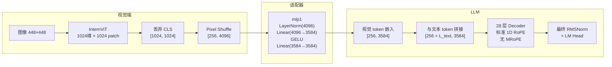
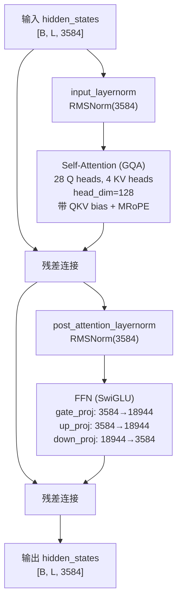

# 文献阅读

- [[A Survey on Benchmarks of Multimodal Large  Language Models]]
- [[A survey on multimodal large language models]]
- [[MM-LLMs Recent Advances in MultiModal Large Language Models]]
- [[DFBench Benchmarking Deepfake Image Detection Capability of  Large Multimodal Models]]
- [[What Do Visual Tokens Really Encode - Uncovering Sparsity and Redundancy in Multimodal Large Language Models]]
# Concept
## InternVL-2.5-8B

使用 “ViT-MLP-LLM” 范式
![[Pasted image 20260913115206.png]]
“新增量预训练的 InternViT-6B 或 InternViT-300M 与各种不同大小和类型的预训练 LLM(包括 InternLM 2.5和 Qwen 2.5)集成在一起，使用随机初始 化的 2 层 MLP 投影仪。
为了增强高分辨率处理的可扩展性，简单地应用了像素 unshuffle 操作，将视觉标记的数量减少到原始的四分之一”
### Vision Encoder

使用 Intern ViT，直接利用 ViT 原生能力（CLS）进行降维
```
输入图像:      [3, 448, 448]
Patch size:    14×14
Patch 数:      448/14 × 448/14 = 32 × 32 = 1024
ViT 输出:      [1025, 1024]  ← 1025 = 1 (CLS) + 1024 (patches)
                ↑     ↑
                token 维度
```
使用 CLS 向量作为整个图像的表征向量

```python
cls_features = outputs.last_hidden_state[:, 0, :] # 提取每个patch的cls
avg_feature = valid_tiles.mean(dim=0) # 对所有有效图块求平均，得到整张图的特征向量 最终形状:[1024]
```
### Adapter

1. 先将 ViT 的输出丢弃掉 CLA token，`[B, 1025, 1024] → [B, 1024, 1024]`
2. 将向量 Reshape 回 2D 空间网络
	```
	[B, 1024, 1024]  →  [B, 32, 32, 1024]
	                        ↑   ↑   ↑
	                        |   |   └── 每个 patch 的特征维度 (C)
	                        |   └────── 宽度方向 patch 数 (W=32)
	                        └────────── 高度方向 patch 数 (H=32)
	```
3. Pixel Shuffle
	把 2×2 空间邻域内的 4 个 patch 拼接
	`[B, 32, 32, 1024]  →  [B, 16, 16, 4096]`
4. Flatten
	`[B, 16, 16, 4096]  →  [B, 256, 4096]`
5. MLP (LayerNorm + Linear + GELU + Linear)
	```
	LayerNorm(4096)
	Linear(4096 → 4096)
	GELU()
	Linear(4096 → 4096)
	```
### LLM

将 adapter 的输出作为初始 token

## InternVL-3-8B

InternVL3-8B和InternVL2.5-8B框架完全相同，核心区别在于训练方式、数据规模和可变视觉位置编码
## Qwen2.5-VL-7B
### ViT
| 参数              | 值       | 说明                        |
| --------------- | ------- | ------------------------- |
| **depth**       | 32      | 32 个 Transformer Block    |
| **hidden_size** | 1280    | 每个 Patch Token 的特征维度      |
| **num_heads**   | 16      | 每个头的维度为 1280 / 16 = 80    |
| **patch_size**  | 14 × 14 | 图像被切割成 14×14 像素的非重叠 Patch |
对图像尺寸没有严格固定要求，是 28 的倍数即可

1. 将所有 patch 通过一个 Conv2d 层，投影到 ViT 的隐藏维度
2. ViT 的 32 层 Transformer 处理后，输出一个序列
	**无 CLS token**
	输出就是纯粹的 Patch Token 序列，没有专门用于全局聚合的特殊 Token
	`ViT 输出:  [N_total, 1280]`
### Adapter

1. Reshape
	```
	[N_patch, 1280]  →  [H_p, W_p, 1280]
                        ↑   ↑   ↑
                        |   |   └── 特征维度 (C=1280)
                        |   └────── 宽度方向 Patch 数 (W_p = W/14)
                        └────────── 高度方向 Patch 数 (H_p = H/14)
	```
2. RMSNorm
	归一化
3. 将 2×2 邻域内的 4 个 Patch 在通道维度上拼接
	```
	[H_p, W_p, 1280]  →  [H_p/2, W_p/2, 5120]
	                        ↑      ↑      ↑
	                        |      |      └── 1280 × 4 = 5120
	                        |      └────────── 宽度减半
	                        └────────────────── 高度减半
	```
4. Flatten
	```
	[H_p/2, W_p/2, 5120]  →  [N_token, 5120]
	                            ↑        ↑
	                            |        └── 每个 Token 5120 维
	                            └────────── N_token = (H_p/2) × (W_p/2) = N_patch / 4
	```
5. MLP
	`[N_token, 5120]  →  [N_token, 3584]`
	```
	Linear(5120 → 5120)
	GELU()
	Linear(5120 → 3584)
	```
### LLM
| 参数                              | 值          | 说明                       |
| ------------------------------- | ---------- | ------------------------ |
| **层数 (num_hidden_layers)**      | **28**     | 28 个 Decoder Layer       |
| **隐藏维度 (hidden_size)**          | **3584**   | 每个 token 的向量维度           |
| **注意力头数 (num_attention_heads)** | **28**     | Query 头数量                |
| **每个头的维度 (head_dim)**           | **128**    | 3584 / 28 = 128          |
| **激活函数 (hidden_act)**           | **silu**   | 即 SwiGLU                 |
| **归一化 (RMSNorm eps)**           | **1e-6**   | 在注意力前和 FFN 前各有一个 RMSNorm |
| **词表大小 (vocab_size)**           | **152064** |                          |
每个 Decoder Layer 的内部结构：


## Qwen3-VL
### ViT

SigLIP-2 Vision Transformer

| 参数              | 值       |
| --------------- | ------- |
| **depth**       | 27      |
| **hidden_size** | 1152    |
| **num_heads**   | 16      |
| **patch_size**  | 16 × 16 |
同样没有 CLS 向量，输出是纯 patch 序列
输出形状：`[B, N_patches, 1152]`
### Adapter

1. 将空间上相邻的 2×2 个patch 在通道维度上进行拼接，得到 `[B, N_patches/4, 4608]` 
2. LayerNorm 归一化
   在进入LayerNorm之前，特征先从4608维被投影到了4096维。这个投影通常通过一个线性层实现，目的是对齐LLM的隐藏维度
3. MLP
   `Linear(4096 → 4096)  →  GELU激活  →  Linear(4096 → 4096)`

---
Qwen3-VL 相较于 Qwen2.5-VL 的改进

1. **多层级视觉融合**
    传统的 Qwen2.5-VL 只是将 Vi 的最后一层输出经过 adapter 后送入 LLM，浅层的高频细节信息在ViT的前向传播中已经被逐层“语义化”
    而 Qwen3-VL 的 ViT 则从多个中间层抽取特征，每一层经过独立的 Merger 处理，然后在 LLM 的不同深度逐步注入
2. Interleaved-MRoPE
   略
3. **注意力机制**
    Qwen2.5-VL 使用窗口注意力来降低计算复杂度，而 Qwen3-VL 使用了全自注意力

---
# Result Analysis

使用 GenImage 数据集（sdv4, ADM, BigGAN, glide, Midjourney, VQDM）

实验思路为：在模型后面加上一个线性探针，使用 sdv4/train 数据集进行探针的训练，在所有的 val 数据集上进行测试

鉴于 MLLM 的结构，一共提取 3 类特征：
- ViT 的原始输出
- ViT 的特征经过 merge 操作后（mlp 前）
- ViT 的特征经过 mlp 后（送入 llm 前）
## 初始结果

ViT：

| 测试集        | InternVL-2.5-8B AUC | Qwen2.5-VL-7B AUC | InternVL-2.5-8B ACC | Qwen2.5-VL-7B ACC |
| ---------- | ------------------- | ----------------- | ------------------- | ----------------- |
| sdv4       | 0.99994             | 0.999997          | 99.83               | 99.93             |
| ADM        | 0.9471              | 0.9662            | 58.16               | 70.58             |
| BigGAN     | 0.7865              | 0.8924            | 50.74               | 59.45             |
| glide      | 0.9597              | 0.9810            | 64.52               | 81.10             |
| Midjourney | 0.9769              | 0.99962           | 80.60               | 99.23             |
| VQDM       | 0.9455              | 0.9748            | 60.36               | 78.00             |
ViT+Merge：

| 测试集        | InternVL-2.5-8B AUC | Qwen2.5-VL-7B AUC | InternVL-2.5-8B ACC | Qwen2.5-VL-7B ACC |
| ---------- | ------------------- | ----------------- | ------------------- | ----------------- |
| sdv4       | 0.99977             | 0.999998          | 99.48               | 99.90             |
| ADM        | 0.9342              | 0.9714            | 64.24               | 75.89             |
| BigGAN     | 0.7891              | 0.8417            | 51.21               | 64.51             |
| glide      | 0.9347              | 0.9833            | 69.20               | 88.52             |
| Midjourney | 0.9672              | 0.99937           | 78.42               | 99.10             |
| VQDM       | 0.9469              | 0.9740            | 69.18               | 82.68             |

ViT+Adapter：

| 测试集        | InternVL-2.5-8B AUC | Qwen2.5-VL-7B AUC | InternVL-2.5-8B ACC | Qwen2.5-VL-7B ACC |
| ---------- | ------------------- | ----------------- | ------------------- | ----------------- |
| sdv4       | 0.99977             | 0.999988          | 99.60               | 99.85             |
| ADM        | 0.9340              | 0.9616            | 62.20               | 74.52             |
| BigGAN     | 0.8188              | 0.7762            | 51.32               | 63.53             |
| glide      | 0.9427              | 0.9749            | 66.29               | 86.26             |
| Midjourney | 0.9586              | 0.99849           | 71.88               | 98.48             |
| VQDM       | 0.9480              | 0.9597            | 67.63               | 80.32             |
1. Adapter 造成 auc 的减小，但增加了 acc（只有 InternVL 在 BigGAN 上的 auc 增加）
2. 添加 adapter 组件后，在 BigGAN 数据集上 Qwen 的 auc 下降了 0.1162，但 InternVL 的 auc 反而上升
3. Qwen的MLP降维操作在每一个跨生成器测试集上都造成了AUC下降，但在 BigGAN 上的损失显著大于其它数据集
## 实验分析
### Qwen2.5-VL-3B

使用 Qwen2.5-VL-3B 模型重复实验

Qwen2.5-VL-3B 与 Qwen2.5-VL-7B 的模型架构基本相同，唯一的区别是 Qwen2.5-VL-3B 最终的输出维度为 2048，而 Qwen2.5-VL-7B 为 3584

通过该对比实验可以检查剥离LLM规模的影响

| 测试集        | Qwen2.5-VL-3B AUC | Qwen2.5-VL-7B AUC | Qwen2.5-VL-3B ACC | Qwen2.5-VL-7B ACC |
| ---------- | ----------------- | ----------------- | ----------------- | ----------------- |
| sdv4       | 0.99997           | 0.99999           | 99.8404           | 99.85             |
| ADM        | 0.9534            | 0.9616            | 73.6583           | 74.52             |
| BigGAN     | 0.8581            | 0.7762            | 63.3167           | 63.53             |
| glide      | 0.9556            | 0.9749            | 81.1667           | 86.26             |
| Midjourney | 0.99815           | 0.99849           | 98.5667           | 98.48             |
| VQDM       | 0.9262            | 0.9597            | 69.7917           | 80.32             |
核心发现：维度下降在其它数据集上都进一步造成了 auc 的降低，但是在 BigGAN 数据集上却反而增加了 auc
### Qwen3-VL-8B

使用 Qwen3-VL-8B 模型重复实验

ViT：

| 测试集        | Qwen3-VL-8B AUC | Qwen2.5-VL-7B AUC | Qwen3-VL-8B ACC | Qwen2.5-VL-7B ACC |
| ---------- | --------------- | ----------------- | --------------- | ----------------- |
| sdv4       | 0.999990        | 0.999997          | 99.83           | 99.86             |
| ADM        | 0.97504         | 0.9662            | 58.16           | 77.54             |
| BigGAN     | 0.96467         | 0.8924            | 50.74           | 73.32             |
| glide      | 0.99648         | 0.9810            | 64.52           | 95.03             |
| Midjourney | 0.99896         | 0.99962           | 80.60           | 98.32             |
| VQDM       | 0.98954         | 0.9748            | 60.36           | 89.13             |
ViT+Adapter：

| 测试集        | Qwen3-VL-8B AUC | Qwen2.5-VL-7B AUC | Qwen3-VL-8B ACC | Qwen2.5-VL-7B ACC |
| ---------- | --------------- | ----------------- | --------------- | ----------------- |
| sdv4       | 0.999988        | 0.999988          | 99.92           | 99.85             |
| ADM        | 0.97384         | 0.9616            | 79.03           | 74.52             |
| BigGAN     | 0.96228         | 0.7762            | 77.55           | 63.53             |
| glide      | 0.99704         | 0.9749            | 95.90           | 86.26             |
| Midjourney | 0.99870         | 0.99849           | 97.73           | 98.48             |
| VQDM       | 0.98898         | 0.9597            | 88.97           | 80.32             |
Qwen3 的 Adapter 几乎不损失信息
### InternVL-3-8B

使用 InternVL-3-8B 模型重复实验

ViT：

| 测试集        | InternVL-3-8B AUC | InternVL-2.5-8B AUC | InternVL-3-8B ACC | InternVL-2.5-8B ACC |
| ---------- | ----------------- | ------------------- | ----------------- | ------------------- |
| sdv4       | 0.99998           | 0.99994             | 99.85             | 99.83               |
| ADM        | 0.9702            | 0.9471              | 69.81             | 58.16               |
| BigGAN     | 0.8087            | 0.7865              | 51.63             | 50.74               |
| glide      | 0.9651            | 0.9597              | 68.90             | 64.52               |
| Midjourney | 0.9901            | 0.9769              | 83.42             | 80.60               |
| VQDM       | 0.9766            | 0.9455              | 73.45             | 60.36               |
ViT+Merge：

| 测试集        | InternVL-3-8B AUC | InternVL-2.5-8B AUC | InternVL-3-8B ACC | InternVL-2.5-8B ACC |
| ---------- | ----------------- | ------------------- | ----------------- | ------------------- |
| sdv4       | 0.99981           | 0.99977             | 99.46             | 99.48               |
| ADM        | 0.9698            | 0.9342              | 76.28             | 64.24               |
| BigGAN     | 0.8546            | 0.7891              | 54.99             | 51.21               |
| glide      | 0.9727            | 0.9347              | 80.70             | 69.20               |
| Midjourney | 0.9833            | 0.9672              | 81.96             | 78.42               |
| VQDM       | 0.9767            | 0.9469              | 79.97             | 69.18               |
ViT+Adapter：

| 测试集        | InternVL-3-8B AUC | InternVL-2.5-8B AUC | InternVL-3-8B ACC | InternVL-2.5-8B ACC |
| ---------- | ----------------- | ------------------- | ----------------- | ------------------- |
| sdv4       | 0.99984           | 0.99977             | 99.51             | 99.60               |
| ADM        | 0.9707            | 0.9340              | 75.90             | 62.20               |
| BigGAN     | 0.8586            | 0.8188              | 54.53             | 51.32               |
| glide      | 0.9707            | 0.9427              | 78.51             | 66.29               |
| Midjourney | 0.9777            | 0.9586              | 76.74             | 71.88               |
| VQDM       | 0.9693            | 0.9480              | 76.17             | 67.63               |
### LLM_1

参考 [[DFBench Benchmarking Deepfake Image Detection Capability of  Large Multimodal Models]] 文章的做法，设计 prompt 测试模型的鉴伪能力

| 测试集        | InternVL-2.5-8B AUC | Qwen2.5-VL-7B AUC | InternVL-2.5-8B ACC | Qwen2.5-VL-7B ACC |
| ---------- | ------------------- | ----------------- | ------------------- | ----------------- |
| sdv4       | 0.8286              | 0.7808            | 0.5715              | 0.5345            |
| ADM        | 0.8676              | 0.7767            | 0.6159              | 0.5330            |
| BigGAN     | 0.9262              | 0.8648            | 0.7508              | 0.5530            |
| glide      | 0.9048              | 0.8432            | 0.6997              | 0.5706            |
| Midjourney | 0.7446              | 0.7916            | 0.5604              | 0.5687            |
| VQDM       | 0.9210              | 0.8526            | 0.7366              | 0.5593            |
### LLM_2

直接提取 LLM 中每一层的 image token，训练 linear probe，跨数据集进行测试

Qwen2.5-VL-7B：
![[results_Qwen2.5-VL-7B_layers.png]]

Qwen3-VL-8B：
![[results_Qwen3-VL-8B_layers.png]]

InternVL-2.5-8B：
![[results_InternVL2.5-8B_layers.png]]
